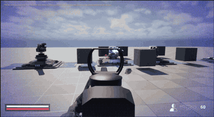

# Outlier

서로 다른 역할의 Shooter와 Partner가 협력하는 Unreal Engine 기반 2인 협동 FPS 프로젝트입니다.

## 프로젝트 소개

Outlier는 총기를 사용하는 Shooter와 비행 및 지원 기능을 가진 Partner가 함께 전투를 진행하는 팀 프로젝트입니다. 두 플레이어는 각자의 전투 방식과 능력을 활용해 협력합니다.

- **Shooter**: 총기 전투, 조준 및 이동, 슈트 능력을 활용하는 FPS 캐릭터
- **Partner**: 비행 이동, EMP·실드·스캔·해킹 및 적 빙의를 활용하는 지원 캐릭터
- **멀티플레이**: Dedicated Server를 중심으로 게임 상태를 처리하고, 각 클라이언트에서 시점과 연출을 표현하는 구조

## 개발 환경

| 항목 | 내용 |
| --- | --- |
| 엔진 | Unreal Engine 5.7 |
| 언어 | C++, Blueprint |
| 개발 환경 | Windows |
| 플레이 인원 | 2인 협동 |
| 네트워크 | Dedicated Server, Replication, RPC |
| 주요 기술 | Gameplay Ability System(GAS), Gameplay Tags, StateTree, AI Perception, UMG |
| 데이터 구성 | DataTable, DataAsset, Curve |
| 버전 관리 | Git, SVN |

## 주요 기능

### 전투 시스템

- 원거리·근접 무기와 데이터 기반 무기 설정
- 서버 권한 기반 피해 처리 및 GAS를 활용한 체력·실드·상태 효과 관리
- 게임플레이 반동, CameraShake, 무기의 Procedural Animation을 구분한 반동 처리
- Shooter 슈트 능력과 Partner 지원 능력

### 멀티플레이

- Shooter와 Partner의 역할 분리 및 Replication/RPC 기반 상태 동기화
- 매치메이킹과 Arena 관리
- Partner의 적 빙의·해제와 AI 제어 복귀 처리

### AI

- StateTree 기반 비전투·전투 행동과 적 유형별 공격 흐름
- AI Perception의 시각·청각 감지
- 방 단위 전투 상태 및 타겟 정보 공유
- 비행 드론, 자폭 드론, 터렛의 행동 처리

### 애니메이션

- 1인칭·3인칭 메시를 분리한 FPS 표현 구조
- 무기 Grip 소켓과 오른손 IK 기준 상대 오프셋을 활용한 왼손 IK
- 조준·달리기·반동·벽 근접 상태의 Procedural Animation 및 Pitch에 따른 팔 보정
- DataAsset과 Curve를 활용한 자세·전환 값 조정

### UI

- 타이틀, 로비, 설정, 성장 및 게임플레이 UI
- Gameplay·GameMenu·Modal·System 레이어별 위젯 스택 관리
- 최상위 UI 레이어에 따른 입력 모드와 포커스 처리

### 주요 코드 위치

아래 링크에서 각 기능의 구현을 확인할 수 있습니다. 팀 전체 기능을 기준으로 정리했으며, 개인별 담당 범위는 하단 포트폴리오에서 안내합니다.

| 영역 | 주요 코드 | 확인할 내용 |
| --- | --- | --- |
| 전투 | [RangedWeaponBase.cpp](https://github.com/RootLaboratory/Outlier/blob/Gameplay/Source/Outlier/Weapon/RangedWeaponBase.cpp), [GAS](https://github.com/RootLaboratory/Outlier/tree/Gameplay/Source/Outlier/GAS) | 원거리 무기 동작과 능력·상태 처리 |
| 멀티플레이 | [Network](https://github.com/RootLaboratory/Outlier/tree/Gameplay/Source/Outlier/Network), [PartnerCharacter.cpp](https://github.com/RootLaboratory/Outlier/blob/Gameplay/Source/Outlier/Drone/Partner/PartnerCharacter.cpp) | 네트워크 흐름과 Partner 제어·빙의 처리 |
| AI | [Enemy](https://github.com/RootLaboratory/Outlier/tree/Gameplay/Source/Outlier/Enemy), [EnemyStateTreeComponent.cpp](https://github.com/RootLaboratory/Outlier/blob/Gameplay/Source/Outlier/Enemy/EnemyStateTreeComponent.cpp) | 적 공통 구조와 StateTree 연동 |
| 애니메이션 | [ShooterFirstPersonAnimInstance.cpp](https://github.com/RootLaboratory/Outlier/blob/Gameplay/Source/Outlier/Shooter/ShooterFirstPersonAnimInstance.cpp), [ProceduralAnimValues.h](https://github.com/RootLaboratory/Outlier/blob/Gameplay/Source/Outlier/Shooter/Anim/ProceduralAnimValues.h) | 1인칭 절차적 애니메이션, IK, 조정 데이터 |
| UI | [LocalPlayerUILayerSubsystem.cpp](https://github.com/RootLaboratory/Outlier/blob/Gameplay/Source/Outlier/UI/LocalPlayerUILayerSubsystem.cpp) | UI 레이어와 입력·포커스 관리 |

## Team

| 역할 | 담당 |
| --- | --- |
| 프로그래밍 | [jinys0527](https://github.com/jinys0527), [earltrash](https://github.com/earltrash) |
| 기획 | 4명 |
| 아트 | 2명 |

## Portfolio / Contribution

팀원별 상세 담당 업무는 각 포트폴리오에서 확인할 수 있습니다.

| 팀원 | 담당 작업 요약 | 포트폴리오 |
| --- | --- | --- |
| [jinys0527](https://github.com/jinys0527) | [FPS 캐릭터](https://github.com/RootLaboratory/Outlier/blob/Gameplay/Source/Outlier/Shooter/ShooterCharacter.cpp) 및 [무기](https://github.com/RootLaboratory/Outlier/tree/Gameplay/Source/Outlier/Weapon), [멀티플레이 게임플레이](https://github.com/RootLaboratory/Outlier/tree/Gameplay/Source/Outlier/Network), [Procedural Animation·IK](https://github.com/RootLaboratory/Outlier/blob/Gameplay/Source/Outlier/Shooter/ShooterFirstPersonAnimInstance.cpp), [Enemy AI](https://github.com/RootLaboratory/Outlier/tree/Gameplay/Source/Outlier/Enemy) | [포트폴리오](https://bubble-dingo-437.notion.site/Outlier-11a8c73c43f9831cb953017900398776?pvs=74) |
| [earltrash](https://github.com/earltrash) | [UI 레이어·HUD](https://github.com/RootLaboratory/Outlier/tree/Gameplay/Source/Outlier/UI) 및 [태그 기반 UI](https://github.com/RootLaboratory/Outlier/tree/Gameplay/Plugins/TagDrivenUI), [RDG 후처리·화면 연출](https://github.com/RootLaboratory/Outlier/tree/Gameplay/Plugins/RDG), [상호작용](https://github.com/RootLaboratory/Outlier/tree/Gameplay/Source/Outlier/Interaction)·해킹 UI, [데이터 기반 업그레이드 및 PlayerState 동기화](https://github.com/RootLaboratory/Outlier/tree/Gameplay/Source/Outlier/Upgrade), [오디오 이벤트 시스템](https://github.com/RootLaboratory/Outlier/tree/Gameplay/Source/Outlier/Audio)·[에셋 생성 도구](https://github.com/RootLaboratory/Outlier/tree/Gameplay/Plugins/AudioTagHelper) | 정리 예정 |
